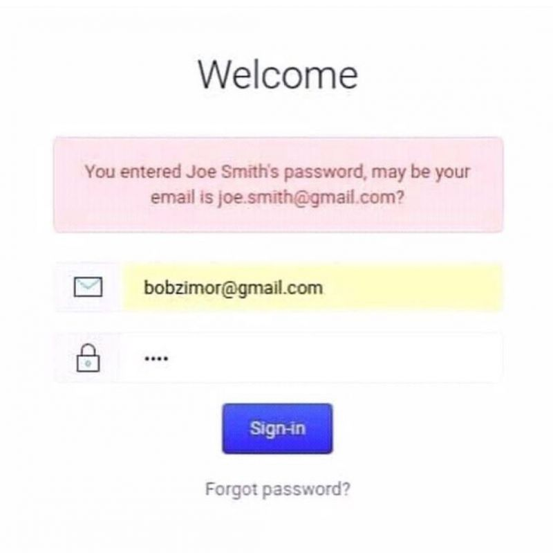

# JS Piscine

# BE 01

## Basic rules

* The Node.JS version used by JS Piscine is LTS 14.x.
* The questions are arranged in ascending order of difficulty.
* Your code will be evaluated through peer review, so please make it **easy for others to read**! (For example, naming variables meaningfully or naming functions according to their functions.)
* For the problem of implementing a function, the function is imported through the module upon evaluation. Therefore, you need to export the function code to be submitted.
  - If there is only one function to be implemented, `default export` must be processed.
* Modules related to development such as **nodemon** and **ESlint** must be defined in `devdependencies`.
* Before proceeding with the evaluation, install all the prerequisite modules through the `npm install` command.
* Unnecessary files like `node_modules` should be properly excluded via `.gitignore`.
* We do not evaluate the code format, but it is recommended to proceed while checking the code format through eslint or beautify.
* **RTFM!!**
* Subjects can be changed up to 1 hour before the submission deadline.
* If you find an error (a typo or logical error) in the issue, please register the issue in the [github repository] (https://github.com/42js/piscine). Your help makes JS Piscine more perfect :)

## before you go in
- You must implement the Status Code and Header according to the request situation presented in the problem. When taking the assessment, the reasons used should be valid and consistent.
- You cannot use raw SQL query by using the query method of the sequlize object within the source code. You need to use Sequelize query and model-related methods to manipulate data in the database.
- This subject proceeds in such a way that functions are added as the practice questions progress in one database. All exercises should retain the content and functionality implemented in the preceding problems.

### [Exercise 00 - Start ORM](ex00.md)
### [Exercise 01 - Create model and table](ex01.md)
### [Exercise 02 - New User](ex02.md)
### [Exercise 03 - Search User](ex03.md)
### [Exercise 04 - QnA](ex04.md)
### [Exercise 05 - Search by various conditions](ex05.md)
### [Exercise 06 - UPDATE & DELETE](ex06.md)